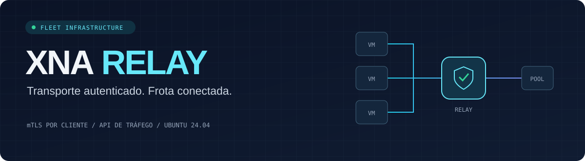
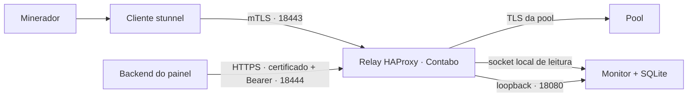

<p align="center">
  
</p>

<p align="center">
  <a href="https://github.com/yashirozz1/xna-relay-server/actions/workflows/tests.yml"></a>
  
  
  
</p>

<p align="center">
  <a href="docs/AZURE-DUAL.md">Azure: PRL GPU + XMR CPU</a> ·
  <a href="docs/FLEET.md">Instalação</a> ·
  <a href="docs/MONITOR-API.md">API do painel</a> ·
  <a href="docs/PKI.md">Certificados</a> ·
  <a href="docs/CAPACITY.md">Capacidade</a>
</p>

Relay TCP para uma frota de clientes, com certificados individuais e uma API de
tráfego para seu painel. Preparado para Ubuntu 24.04 na Contabo, usando HAProxy,
stunnel e FastAPI. O backend do painel consulta as métricas por HTTPS.

## Instalação rápida no Linux

Na máquina de administração, com Python 3.10+ e OpenSSL:

```bash
curl -fsSL https://raw.githubusercontent.com/yashirozz1/xna-relay-server/main/bootstrap.sh | bash
```

Ou com `wget`:

```bash
wget -qO- https://raw.githubusercontent.com/yashirozz1/xna-relay-server/main/bootstrap.sh | bash
```

O comando baixa o projeto em `~/.local/share/xna-relay` e abre o menu, inclusive
quando executado por pipe. Não precisa de Git nem de `sudo` nessa etapa. No Ubuntu
24.04, se faltarem dependências:

```bash
sudo apt-get update && sudo apt-get install -y curl python3 openssl tar
```

Para reabrir depois:

```bash
bash ~/.local/share/xna-relay/install.sh
```

Para baixar sem abrir o menu, acrescente `-s -- --no-launch` ao `bash` do comando
com curl. Uma pasta existente nunca é sobrescrita; use `XNA_INSTALL_DIR` para
escolher uma pasta nova:

```bash
curl -fsSL https://raw.githubusercontent.com/yashirozz1/xna-relay-server/main/bootstrap.sh | XNA_INSTALL_DIR="$HOME/xna-relay" bash
```

Também é possível baixar o script para inspecioná-lo ou clonar o repositório:

```bash
curl -fsSLo bootstrap.sh https://raw.githubusercontent.com/yashirozz1/xna-relay-server/main/bootstrap.sh
less bootstrap.sh
bash bootstrap.sh
```

```bash
git clone https://github.com/yashirozz1/xna-relay-server.git
cd xna-relay-server
bash install.sh
```

## Menu de instalação

```text
    XNA RELAY SERVER
    Transporte autenticado. Frota conectada.
    --------------------------------------------------
    Central de instalacao

    1  Preparar uma nova frota
       IP, quantidade de clientes e certificados individuais

    2  Instalar relay + API
       Selecionar o pacote relay/ para esta Contabo

    3  Instalar cliente
       Selecionar o pacote clients/ID/ para esta VM

    4  Status dos servicos
    5  Guia rapido
    0  Sair
```

O menu tem abertura animada, cores e indicador de progresso durante a geração de
certificados. Para um terminal simples, use `bash install.sh --no-color`; para
desativar apenas as animações, `bash install.sh --no-animation`.
`NO_COLOR=1` e `XNA_NO_ANIMATION=1` também são reconhecidos.

1. **Prepare a frota.** Informe o IPv4 da Contabo, a quantidade de clientes e duas
   pastas novas: uma para a CA privada e outra para os pacotes. A senha da CA não
   é exibida. O menu cria IDs como `gpu0001`, um certificado por cliente e a
   identidade `monitor-panel`.
2. **Distribua por destinatário.** `relay/` vai à Contabo; cada `clients/ID/` vai
   apenas à sua VM; `panel/` fica no backend do painel. Guarde a CA na máquina
   de administração.
3. **Instale no destino.** Dentro do pacote transferido, execute
   `sudo bash install.sh` e escolha instalar. O menu apresenta o que será feito.
4. **Valide a conexão.** Configure o minerador para
   `stratum+tcp://127.0.0.1:17048` e consulte a API pelo backend do painel.

O assistente cria uma **nova frota**. Para expandir uma existente, emitir/revogar
certificados ou configurar pool e portas diferentes, siga o [guia completo](docs/FLEET.md)
e a [CLI da PKI](docs/PKI.md). Após uma preparação interrompida, preserve a CA
parcial e use a CLI para concluir; o menu nunca sobrescreve chaves existentes.

## Como funciona



O cliente valida o TLS da pool dentro do túnel mTLS do relay. A API informa bytes,
conexões, taxas, erros e histórico por cliente; não inspeciona carteira, shares
ou hashrate. O token e o certificado do painel ficam no backend, fora do navegador.

| Padrão | Valor |
|---|---|
| Conexões simultâneas globais | 2.048 |
| Conexões por certificado | 8 |
| IDs aceitos no manifesto | Até 1.024 |
| Coleta / retenção | 15 segundos / 72 horas |
| Cenário local de carga verificado | 300 conexões em duas ondas |

Os limites de configuração não são uma garantia de capacidade da VPS.
[Veja a metodologia e os resultados](docs/CAPACITY.md).

## Operação

- Os instaladores criam serviços sem root e recusam sobrescrever uma instalação
  existente. Não alteram SSH, firewall ou rotas.
- Restrinja a porta da API ao IP do backend do painel e preserve seu acesso SSH.
- Renove a CRL antes do vencimento de 30 dias. Emissão, renovação e revogação usam
  um bloqueio compartilhado para evitar alterações concorrentes da CA.
- Em automação, use **no pacote gerado** `sudo bash install.sh --non-interactive`.
  Abrir o menu com entrada redirecionada não inicia uma instalação.
- TLS protege o conteúdo; IP, porta, SNI, volume e horários continuam observáveis.
  O relay não oferece ocultação de mineração. O cliente gerado não faz fallback
  direto, mas conexões próprias do minerador precisam ser avaliadas separadamente.

## Desenvolvimento e testes

```bash
python3 -m venv .tools/monitor-venv
.tools/monitor-venv/bin/pip install -r requirements-monitor.txt
bash scripts/prepare-test-tools.sh
bash scripts/test.sh
```

O bootstrap de binários atende Ubuntu 24.04 amd64 e extrai as ferramentas
localmente, sem instalar serviços. Também é possível usar HAProxy, stunnel e
OpenSSL já instalados. No Windows com WSL Ubuntu, use `scripts/test.ps1` após
preparar as dependências Python no Windows e no WSL.

Os testes usam certificados temporários e uma pool TLS local. Não iniciam
mineração nem precisam de carteira. [Resultados e pendências](TEST-RESULTS.md).

## Documentação

| Guia | Conteúdo |
|---|---|
| [Fleet](docs/FLEET.md) | Pacotes, deploy, firewall e integração |
| [API](docs/MONITOR-API.md) | Endpoints, autenticação e métricas |
| [PKI](docs/PKI.md) | CA, certificados, renovação e revogação |
| [Capacidade](docs/CAPACITY.md) | Carga de 300 clientes e histórico |
| [Relay V1](docs/LEGACY.md) | Versão anterior, por IP de origem |
